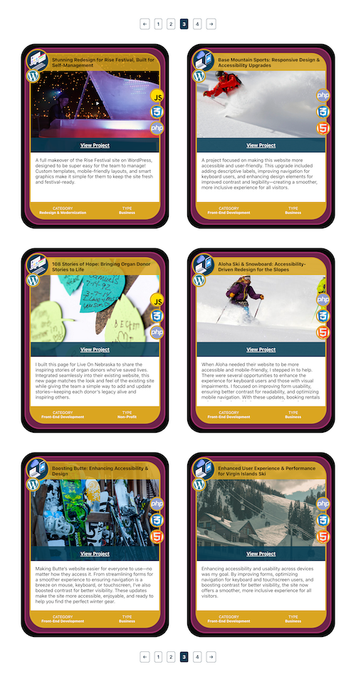

<a id="readme-top"></a>

# Tecnate Portfolio

### Version 2.0

<a href="https://tecnate.dev" target="_blank" rel="author">Tecnate</a> | Last Updated: 24 Oct 2024

<!-- TABLE OF CONTENTS -->
<details>
  <summary>Table of Contents</summary>
  <ol>
    <li>
      <a href="#about-the-project">About The Project</a>
      <ul>
        <li><a href="#built-with">Built With</a></li>
      </ul>
    </li>
    <li>
      <a href="#getting-started">Getting Started</a>
      <ul>v
        <li><a href="#prerequisites">Prerequisites</a></li>
        <li><a href="#installation">Installation</a></li>
      </ul>
    </li>
    <li><a href="#usage">Usage</a></li>
    <li><a href="#roadmap">Roadmap</a></li>
    <li><a href="#contributing">Contributing</a></li>
    <li><a href="#license">License</a></li>
    <li><a href="#contact">Contact</a></li>
    <li><a href="#acknowledgments">Acknowledgments</a></li>
  </ol>
</details>

<!-- ABOUT THE PROJECT -->

## About The Project

This is a newly designed portfolio for <a href="https://tecnate.dev/portfolio" target="_blank" rel="author">Tecnate</a>, customized specifically for use with the Oxygen Builder in WordPress. The project utilizes:

-   A custom post type and custom fields.
-   A custom post type query, declared globally.
-   The `WP_Query` constructor and **The Loop** for WordPress.
-   Arrays.
-   Pagination.
-   Integration with my customized Bootstrap-inspired layout and stylesheets.

<!-- <div align="center">




</div> -->

### Built With

-   HTML
-   CSS
-   PHP
-   WordPress

<!-- GETTING STARTED -->

## Getting Started

This portfolio was crafted for WordPress.

### Prerequisites

-   WordPress installation
    -   Oxygen plugin
    -   ACF (or SCF) plugin
    -   CPTUI plugin
-   CSS stylesheets:
    -   Customized Bootstrap-inspired layout.
    -   Designs and text styles.

### Installation

1. Install WordPress and the plugins listed above.
2. Add the customized stylesheets.
3. Create the custom post type and post fields.
4. Populate the custom post type fields with data as needed.
5. All final development work should be done (or imported) into Oxygen directly. See the **Usage** section below for details.

<!-- USAGE EXAMPLES -->

## Usage

I needed a customized, completely controllable design and functionality for my portfolio, rather than relying on preset style/code. But I still wanted everything to remain in my Oxygen Builder to keep my website code consolidated under a single source.

So here's how to do it:

1. Develop all code in a text editor of your choice.
2. Copy over the final code into Oxygen:

### Code Blocks in Oxygen

1. Global Queries Code Block: Initializes custom queries globally, including for the custom post type. See the _Global Queries_ section below for notes about how this code works.
    - Declare global variables in order to use pagination and custom portfolio icons anywhere in the **posts** page section. Otherwise, The Loop will get very messy!
    - Dev file: [global-queries.php](global-queries.php)
2. Top Pagination Code Block: Uses the post-type query in the pagination block before the posts render.
    - Dev file: [pagination.php](pagination.php)
3. Posts Code Block: Uses the global queries defined in the first code block to execute The Loop and render portfolio items and custom icons.
    - Dev file: [portfolio-posts.php](portfolio-posts.php).
4. Bottom Pagination Code Block: Uses the post-type query in the pagination block after the posts render. This reuses the same code as the Top Pagination (for now).
    - Dev file: [pagination.php](pagination.php)

#### Global Queries

This custom post type query and pagination system works as follows:

```php
// Get current page number from URL, or default to 1 if not set
$paged = (get_query_var('paged')) ? get_query_var('paged') : 1;

// Set up an array of query arguments for the custom post type
// Set 'paged' to the current page number to tell WordPress to fetch the posts from the correct page in the pagination.
$args = array(
    'post_type' => 'portfolio',
    'posts_per_page' => 10,
    'paged' => $paged
);

// Pass the query arguments into a new instance of the WP_Query constructor class.
// This builds the SQL query that fetches posts from the database.
$portfolio_query = new WP_Query( $args );
```

For icon mapping, the pattern is as follows: `'ACF Choice Value' => 'Icon Name'`

-   ACF Choice values can be viewed from the WP Dashboard/ACF (or SCF at the time of this document update.)

-   Icon Name Pattern = `'portfolio(SVG symbol ID)'`
    -   Note: These are custom icons that have been uploaded into Oxygen as an SVG set named "portfolio". You must adhere to this naming pattern for the icons to render.
-   Dev File (SVG icon set): [symbol-defs.svg](symbol-defs.svg).

<!-- ROADMAP -->

## Roadmap

TBD

<!-- CONTRIBUTING -->

## Contributing

This is a customized portfolio design built specifically with the WordPress/Oxygen framework in mind. I'm not accepting code contributions for this project at this time, however I'm always open to suggestions.

<!-- LICENSE -->

## License

Distributed under the [MIT License](https://choosealicense.com/licenses/mit/).

<!-- CONTACT -->

## Contact

Nate: [Website](https://tecnate.dev/) | [GitHub](https://github.com/nvsmith) | [Gravatar](https://gravatar.com/nvsmith435)

<!-- ACKNOWLEDGMENTS -->

## Acknowledgments

#### README Template

-   [Best README Template](https://github.com/othneildrew/Best-README-Template/tree/master)

<p align="right">(<a href="#readme-top">back to top</a>)</p>
